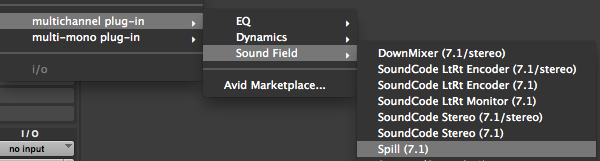

# Using the Spill Plug-In

Here is how to use the Spill Plug-in in Pro Tools.

* Create a multi-channel track. Spill can be used on any track from stereo up to a 16-channel immersive format.
* Click on the insert slot for the track and select multichannel plug-in->Sound Field->Spill.

* Individual channels can be adjusted by moving the faders.
* Grouping is available by clicking on the channel letter.
* Use the Bypass button to bypass the plug-in on the track.
* The meters display the input levels coming in to the plug-in.
* Click on the (i) button to view info about the Spill Plug-in

## Supported Track Formats

Spill matches the stem format of the track it is inserted on. Every supported format runs as an AAX Native plug-in and as an AudioSuite plug-in. The formats marked **Yes** under DSP also run on Pro Tools | HDX DSP hardware.

| Track Format | Channels | HDX DSP |
| --- | --- | --- |
| Stereo | 2 | Yes |
| LCR | 3 | Yes |
| LCRS | 4 | Yes |
| Quad | 4 | Yes |
| 5.0 | 5 | Yes |
| 5.1 | 6 | Yes |
| 6.0 | 6 | Yes |
| 6.1 | 7 | Yes |
| 7.0 (DTS) | 7 | Yes |
| 7.1 (DTS) | 8 | Yes |
| 7.0 (SDDS) | 7 | Yes |
| 7.1 (SDDS) | 8 | Yes |
| 7.0.2 | 9 | Yes |
| 7.1.2 | 10 | Yes |
| 1st Order Ambisonics | 4 | Yes |
| 2nd Order Ambisonics | 9 | Yes |
| 5.0.2 | 7 | No |
| 5.1.2 | 8 | No |
| 5.0.4 | 9 | No |
| 5.1.4 | 10 | No |
| 7.0.4 | 11 | No |
| 7.1.4 | 12 | No |
| 7.0.6 | 13 | No |
| 7.1.6 | 14 | No |
| 9.0.4 | 13 | No |
| 9.1.4 | 14 | No |
| 9.0.6 | 15 | No |
| 9.1.6 | 16 | No |
| 3rd Order Ambisonics | 16 | No |

The immersive formats listed as **No** are available as AAX Native and AudioSuite plug-ins only. On an HDX system, insert Spill on those tracks in Native mode.